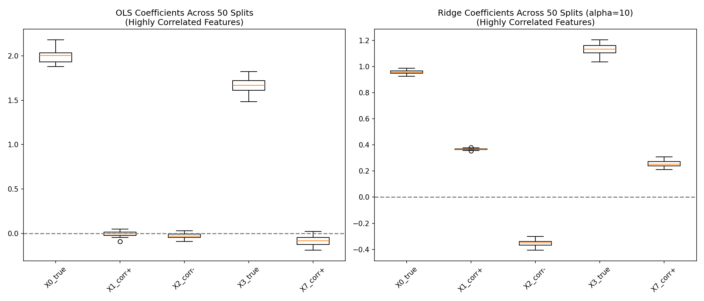
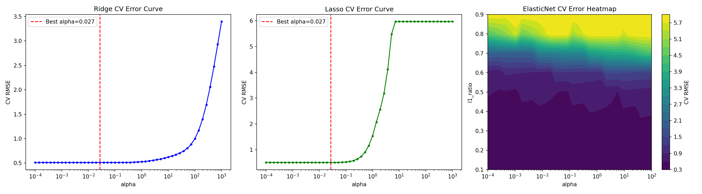

# Synthetic Correlated Data Report

## DGP (Data Generating Process)

**真实公式:**
```
y = 3.0 + 2.0 * X0 + 1.5 * X3 + ε
ε ~ N(0, 0.5²)
```

### 特征说明

| 特征 | 描述 | 是否真实信号 |
|------|------|-------------|
| X0_true   | 均匀分布 [0, 10] | ✅ 系数=2.0 |
| X1_corr+  | X0*2 + noise     | ❌ 与 X0 高度正相关 (r≈0.97) |
| X2_corr-  | X0*(-0.8)+noise  | ❌ 与 X0 高度负相关 (r≈-0.9) |
| X3_true   | N(0,1)           | ✅ 系数=1.5 |
| X4_noise  | N(0,1)           | ❌ 纯噪声 |
| X5_noise  | N(0,1)           | ❌ 纯噪声 |
| X6_noise  | N(0,1)           | ❌ 纯噪声 |
| X7_corr+  | X3*1.5+noise     | ❌ 与 X3 高度正相关 (r≈0.98) |
| X8_noise  | N(0,1)           | ❌ 纯噪声 |

**共线性族:** 
- 族1: X0, X1, X2 (高度相关)
- 族2: X3, X7 (高度相关)
- 噪声: X4, X5, X6, X8

## A3.1 稳定性对比 (50 次随机切分)

### 系数标准差 (仅展示高度相关族)

| 特征 | OLS std | Ridge std | 稳定性改善 |
|------|---------|-----------|-----------|
| X0_true | 0.0636 | 0.0134 | ✅ |
| X1_corr+ | 0.0287 | 0.0049 | ✅ |
| X2_corr- | 0.0277 | 0.0215 | ✅ |
| X3_true | 0.0806 | 0.0386 | ✅ |
| X7_corr+ | 0.0515 | 0.0255 | ✅ |



## A3.2 Pipeline 与标准化

**为什么 Ridge/Lasso 前必须标准化?**

Ridge 和 Lasso 的罚项是对系数向量施加 L2/L1 约束。
如果特征尺度不一致（如 X0 范围 [0,10]，X3 范围 [-3,3])，
则罚项对不同特征的惩罚力度实际不同——尺度大的特征会被"过度惩罚"。
标准化后每个特征均值=0、标准差=1，罚项对所有特征公平施加。

## A3.3 GridSearchCV 最优超参数

- **Ridge** 最优 alpha = `0.0268`
- **Lasso** 最优 alpha = `0.0268`
- **ElasticNet** 最优 alpha = `0.0007`, l1_ratio = `0.9000`



## A3.4 模型性格大比拼 (测试集)

### 测试集表现

| 模型 | RMSE | MAE |
|------|------|-----|
| OLS | 0.5221 | 0.4139 |
| Ridge (CV best) | 0.5219 | 0.4137 |
| Lasso (CV best) | 0.5189 | 0.4129 |
| ElasticNet (CV best) | 0.5212 | 0.4139 |

### 各模型系数对比

| 特征 | OLS | Ridge | Lasso | ElasticNet |
|------|-----|-------|-------|------------|
| X0_true | 2.0086 | 1.9880 | 1.9937 | 1.9975 |
| X1_corr+ | -0.0025 | 0.0067 | 0.0000 | 0.0020 |
| X2_corr- | -0.0010 | -0.0035 | -0.0000 | -0.0030 |
| X3_true | 1.7410 | 1.7384 | 1.5059 | 1.6977 |
| X4_noise | 0.0075 | 0.0072 | 0.0000 | 0.0061 |
| X5_noise | 0.0636 | 0.0635 | 0.0300 | 0.0619 |
| X6_noise | -0.0219 | -0.0222 | -0.0000 | -0.0208 |
| X7_corr+ | -0.1358 | -0.1341 | 0.0000 | -0.1080 |
| X8_noise | -0.0033 | -0.0033 | -0.0000 | -0.0036 |

### 模型性格分析

- **Ridge:** 对共线性族 X0/X1/X2 和 X3/X7 均进行均匀缩小，不会将系数压缩至零。
  所有特征都保留，只是在幅度上受到约束。
- **Lasso:** 展现出"赢者通吃"行为。在共线性族中可能只保留一个（如 X0），
  而将其相关变量 X1/X2 压缩至零。这是 L1 惩罚的固有性质。
- **ElasticNet:** 介于两者之间。l1_ratio 控制 L1 和 L2 的比例，
  既能像 Lasso 一样做变量选择，又能像 Ridge 一样保留共线组的部分结构。

## A4. 变量筛选对比

- **Forward Selection (Top-6):** ['X0_true', 'X3_true', 'X5_noise', 'X7_corr+']
- **Backward Elimination:** ['X0_true', 'X3_true', 'X5_noise']
- **Lasso 非零变量:** ['X0_true', 'X3_true', 'X5_noise']

### 一致性分析

传统的逐步回归（前向/后向）与 Lasso 在变量选择上可能存在差异：
- Lasso 通过连续惩罚实现变量选择，效率更高
- 前向选择每次只加一个变量，可能忽略变量间的联合效应
- 后向剔除从全模型开始，计算开销大但对变量间关系考虑更全面
