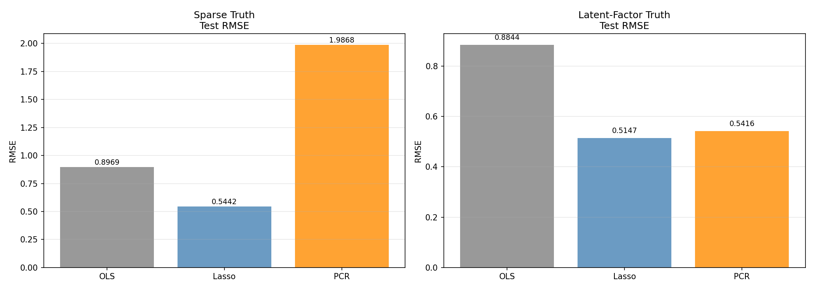

# Lasso vs PCR: Selection vs Compression (Task C)

## C1 & C2. 两种数据世界中的对比

### Sparse Truth

| 方法 | Test RMSE | Test MAE | 复杂度指标 | 稳定性 |
|------|----------|----------|-----------|--------|
| OLS | 0.8969 | 0.6867 | 全部变量 | — |
| Lasso | 0.5442 | 0.4252 | 非零系数=27 | 0.0113 |
| PCR | 1.9868 | 1.5571 | k=30 | nan |

### Latent-Factor Truth

| 方法 | Test RMSE | Test MAE | 复杂度指标 | 稳定性 |
|------|----------|----------|-----------|--------|
| OLS | 0.8844 | 0.7117 | 全部变量 | — |
| Lasso | 0.5147 | 0.4423 | 非零系数=8 | 0.0076 |
| PCR | 0.5416 | 0.4610 | k=5 | nan |

**图说明:** 左右两图分别对应 Sparse Truth 和 Latent-Factor Truth 场景。
横轴=方法 (OLS/Lasso/PCR), 纵轴=测试集 RMSE, 柱上数字为具体数值。

## C3. 核心问题讨论

### Q1: 当数据真的是 sparse truth 时，为什么 Lasso 往往更自然？

Sparse truth 的本质是"只有少数原始变量真正重要"。
Lasso 的 L1 惩罚天然倾向于产生稀疏解——将不重要变量的系数压缩为零，
直接给出一个"谁留下、谁走开"的清晰答案。这恰好匹配 sparse truth 的生成机制。

### Q2: 当数据更像 latent-factor truth 时，为什么 PCR 往往更自然？

Latent-factor truth 的本质是"原始变量只是潜在因子的投影"。
此时没有一个原始变量是"真正重要"的——重要的是那些方向（主成分）。
PCR 先找出方差最大的方向，再在这些方向上回归，恰好在做"信息压缩"而非"变量挑选"。
它不关心某个具体变量是否留下，而是关心多少信息被保留。

### Q3: Lasso 回答的更像"谁留下"，PCR 回答的更像什么？

Lasso 回答的是: **"哪些原始变量对 y 有直接的、独立的贡献？"**
PCR 回答的是: **"多少信息维度足以描述 X→y 的关系？"**

一个做 **selection**（挑选），一个做 **compression**（压缩）。

### Q4: 如果业务方要求"一个更短的变量名单"，你更可能用哪个方法？

**Lasso。** 因为它直接在原始变量空间中给出非零系数名单，
业务方可以直接理解"这 5 个变量是关键的"。
而 PCR 的主成分是原始变量的线性组合，难以用业务语言解释。

### Q5: 如果业务方要求"一个更稳的预测器"，你更可能用哪个方法？

**PCR。** 因为 PCR 舍弃了噪声方向（小方差主成分），只保留信息最集中的方向，
在高维共线性场景下通常比 Lasso 更稳定——它不受"同一族中选哪个"的困扰。
但最终选择也取决于数据更接近哪种生成机制。

## C4. 为什么不把前向/后向选择拉回主舞台？

本周主线是 **selection vs compression** 这一对更高层次的方法论对比。
前向/后向选择本质上也属于 selection 路线（在原始变量中挑子集），
与 Lasso 属于同一阵营——因此把它拉回来会淡化"压缩"这条线。

如果要归类：前向/后向选择更接近 **selection** 路线——
它回答的也是"哪些列有用"，而不是"数据本身有多高维"。
