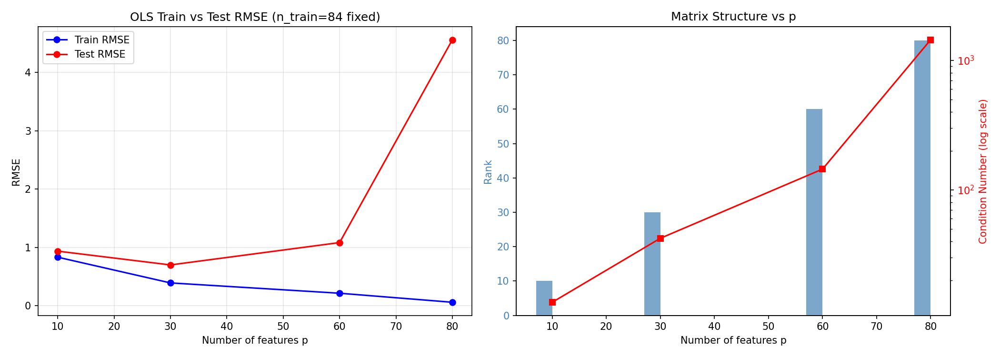
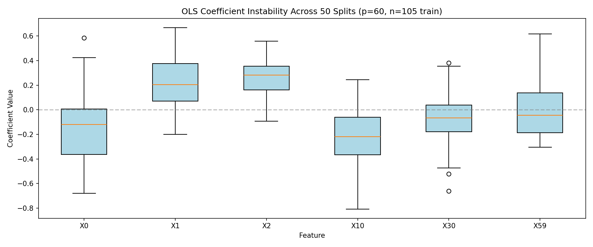
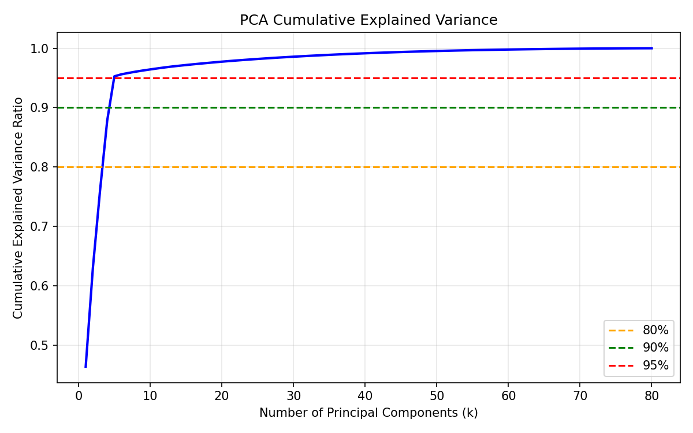
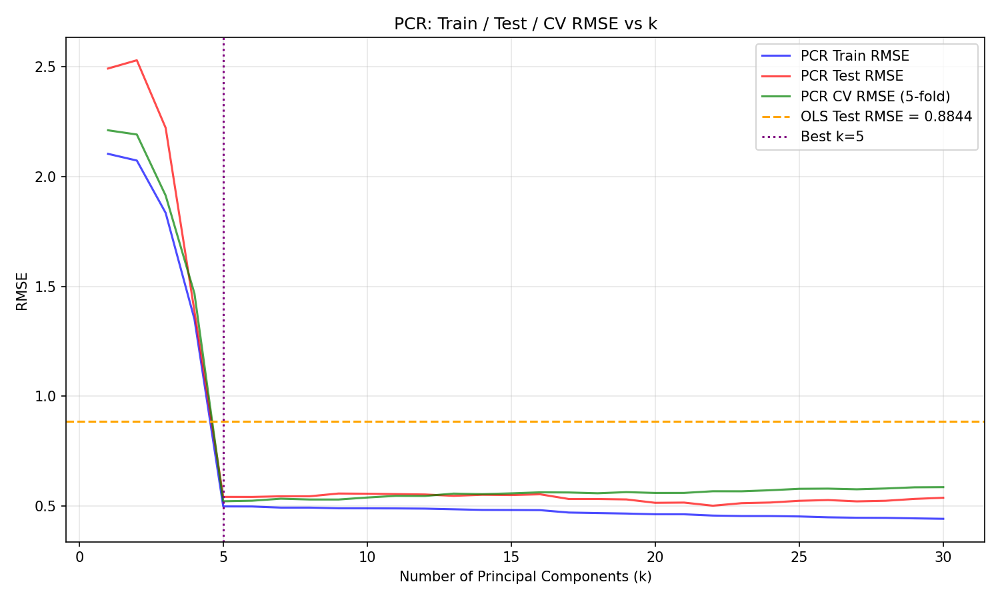

# Synthetic High-Dimensional Data Report (Task A & B)

## 数据生成机制 (DGP)

- **样本量:** n = 150
- **特征数:** p = 80 (可超训练样本数)
- **潜在因子结构:** 5 个潜在因子 F0~F4，每个 ~ N(0,1)
- **观测变量生成:** 每个 X_j 是 2~3 个随机潜在因子的线性组合 + N(0, 0.3²)
- **目标变量:** y = 2.0 * F0 + 1.5 * F1 + N(0, 0.5²)

这是一个典型的 **高维 + 信息冗余** 数据：
- p 接近甚至超过训练样本量，OLS 面临自由度不足
- 大量特征共享同一组潜在因子，存在严重多重共线性
- 真正驱动 y 的只有 2 个潜在方向，信息高度集中在低维子空间中

## Task A: OLS 在高维场景下的失败

### A3. 不同特征维度下的 OLS 表现

| p | rank(X_train) | Condition Number | Train RMSE | Test RMSE |
|---|--------------|-----------------|------------|-----------|
| 10 | 10 | 1.36e+01 | 0.8315 | 0.9353 |
| 30 | 30 | 4.24e+01 | 0.3899 | 0.6985 |
| 60 | 60 | 1.45e+02 | 0.2128 | 1.0821 |
| 80 | 80 | 1.44e+03 | 0.0578 | 4.5628 |

**图说明:**
- 左图: 横轴=特征数 p, 纵轴=RMSE; 蓝色=训练集, 红色=测试集
- 右图: 横轴=特征数 p; 柱状图=rank(X_train), 红线=Condition Number (对数刻度)

### 为什么训练误差接近 0 反而是危险信号？

当 p ≥ n 时，OLS 可以在训练集上完美拟合（或接近完美），
但这通常意味着模型在"记忆噪声"而非学习信号。
此时 condition number 急剧增大，矩阵近乎奇异，
系数的方差趋于无穷——换一组样本，系数可能面目全非。
这就是著名的 **bias-variance tradeoff** 在高维场景下的极端体现。

### A4. 系数不稳定性

**图说明:**
- 横轴=特征名 (选取 X0,X1,X2,X10,X30,X59 共 6 个代表性变量)
- 纵轴=OLS 回归系数值
- 每个箱线代表该变量在 50 次不同随机切分下的系数分布

**观察:** 同一变量的系数在不同切分下剧烈波动（箱线跨度大），
说明 OLS 估计极度不稳定。在实际业务中，这意味着：
> 你无法可靠地告诉业务方"这个变量到底有多重要"——
> 因为换一批数据，答案可能完全相反。

## Task B: PCA 与 PCR

### B1. PCA 累计解释方差

- 80% 方差需要 k=4 个主成分
- 90% 方差需要 k=5 个主成分
- 95% 方差需要 k=5 个主成分

**图说明:** 横轴=主成分数 k, 纵轴=累计解释方差比例。
虚线标注了 80%/90%/95% 阈值。

**解释:** 原始 80 维空间其实贴近一个更低的 k 维子空间。
前几个主成分就'吃下'了大部分方差，说明信息高度冗余、
原始数据存在强共线性——这正好印证了 OLS 不稳定的根源。

### B2. PCR 在不同 k 下的表现

最优 k (min CV RMSE) = **5**
OLS 基线: train_rmse=0.2331, test_rmse=0.8844

**图说明:**
- 横轴=保留的主成分数 k
- 纵轴=RMSE
- 蓝线=训练集 RMSE, 红线=测试集 RMSE, 绿线=5折 CV RMSE
- 橙色虚线=OLS 测试集 RMSE 作为基线

### B3. CV 曲线解释

**PCR CV RMSE** 代表在未见过的验证折上的平均预测误差，是模型泛化能力的无偏估计。

- **train 曲线** 单调下降：更多 PC → 更多信息 → 训练误差更低
- **test/CV 曲线** 呈 U 型：先降后升。
  太少 PC 会欠拟合（丢失有用信号），太多 PC 会引入噪声方向导致过拟合
- OLS 在原始高维空间训练误差极低甚至为 0，但测试误差很高——
  因为它把噪声方向也当作信号来拟合了。PCR 通过舍弃小方差方向避免了这一问题

### B4. 公式与定义

**OLS 估计式:**

$$\hat{\beta}_{OLS} = (X^T X)^{-1} X^T y$$

**第一主成分的方差最大化定义:**

$$v_1 = \arg\max_{\|v\|=1} \text{Var}(X v) = \arg\max_{\|v\|=1} v^T \Sigma v$$

其中 $\Sigma = \frac{1}{n} X^T X$ 是协方差矩阵（已中心化）。

**PCR 流程:**

1. 标准化: $\tilde{X} = (X - \mu) / \sigma$
2. PCA: $\tilde{X} = U S V^T$, 取 $V_k$ (前 k 列)
3. 投影: $Z_k = \tilde{X} V_k$
4. 回归: $\hat{y} = Z_k \hat{\gamma}_k$, 其中 $\hat{\gamma}_k = (Z_k^T Z_k)^{-1} Z_k^T y$
5. 原始尺度系数: $\hat{\beta}_{PCR} = V_k \hat{\gamma}_k / \sigma$
